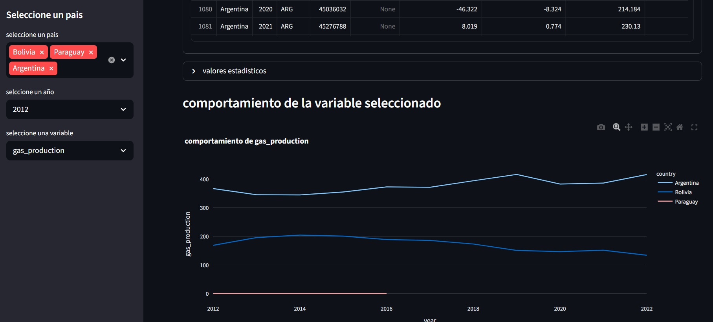

# creando-dashboard
# Dashboard Interactivo: Análisis Global de Consumo Energético
Se crea un dashboar sencillo para ver la tendencias de algunos paises en cuanto sus recursos, a partir del dataset, creamos el archivo conexion, en el cual creamos un boton que nos abre una pagina y este a su vez abre el archuvo nuevo.py donde creamos el dashboard
El objetivo principal es transformar datos estadísticos tabulares en una herramienta visual dinámica que facilite la toma de decisiones y la comparación entre distintos países (como Bolivia, Argentina, Paraguay, entre otros).

## 🛠️ Tecnologías Utilizadas

* **Python** (Lenguaje principal)
* **Pandas** (Manipulación y limpieza de datos estructurados)
* **Visualización:** *Streamlit, tkinter,  Matplotlib*

  

